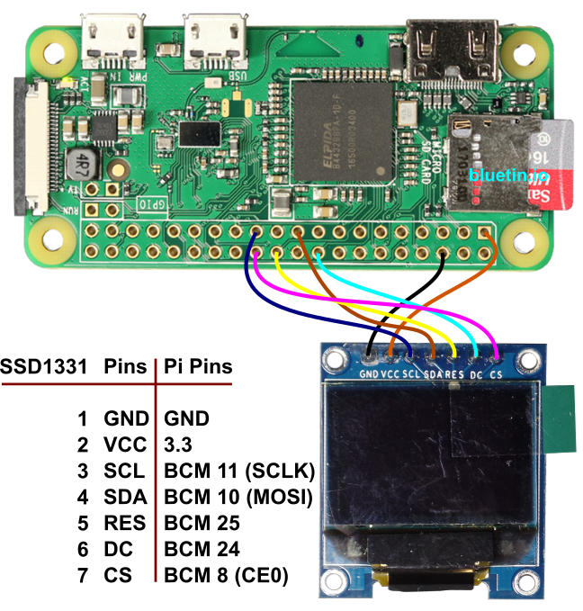

# Eyes for Blu

The following will help you get the eyes up and running for Blu. From the required libraries to the gpio pin layout required to display the eyes on the screen properly.

## Requirements

First make sure you have python3 and all the required dependencies with it.
```
sudo apt-get install python3-dev python3-pip libfreetype6-dev 
sudo apt-get install libjpeg-dev build-essential

sudo -H pip3 install --upgrade luma.oled

sudo apt install libsdl-dev libportmidi-dev libsdl-ttf2.0-dev
sudo apt install libsdl-mixer1.2-dev libsdl-image1.2-dev
```

In the raspberry pi home directory clone the following library for the eyes.
```
git clone https://github.com/rm-hull/luma.examples.git luma
cd luma
sudo -H pip install -e .
```

last make sure that the SPI settings have been enabled in the raspi-config.
```
sudo raspi-config
select Advance Setting
select SPI
enable SPI
```

now reboot the raspberry pi to make sure all the permissions are set properly
```
sudo reboot
```

## Setup the python file

clone this repo and copy the required files over to luma directory.
```
cd
git clone https://github.com/WeThinkCodeRobotics/Blu.git
cp Blu/eyes/animate_eyes.py luma/examples/.
cp Blu/eyes/images/* luma/examples/images/.
```

## Start the eyes

if you have setup the directories as mentioned above you should now be able to run the following command from the home directory.
```
python3 luma/examples/animate_eyes.py -d ssd1331.conf -i spi --width 96 --height 64
```

## GPIO CONNECTION

This part is important that you get all the pins in the correct order.
Links are attached at the bottom to help figure out pin layout on a raspberry pi. Look for the square soldering under the pi to match the square icon on the layout page to know which way is up.  

At the moment we can only control both screens using the same pin layout since we don't have a pi hat to control more than one screen seperately. This is the following layout we are using. Look at the labels on the wires to know which goes where. 

| Display        | Pi 3 pin       |
| -------------- |:--------------:|
| GND            | any GND        |
| VCC            | any +3V        |
| SCL            | 23 SCLK (SPI)  |
| SDA            | 19 MOSI (SPI)  |
| RES            | 22 GPIO 25     |
| DC             | 18 GPIO 24     |
| CS             | 24 CE0 (SPI)   |

The image below is from [OLED Display Library Setup for the Raspberry Pi featuring SSD1331](https://www.bluetin.io/displays/oled-display-raspberry-pi-ssd1331/).
It shows Pi Zero but I used exactly the same pins for the regular Pi 3 model B.


pinlayout site - https://pinout.xyz

# helpful links

Luma.oled setup - https://www.bluetin.io/displays/oled-display-raspberry-pi-ssd1331/  
Luma documentation - https://luma-oled.readthedocs.io/en/latest/  
